# Vivat
This application allows users to create product orders and synchronize them with the database on the fly. The application provides a convenient interface for entering orders, and transferring data to a central database for further processing.

# Technology Stack
* **Programming language:** [kotlin](https://kotlinlang.org/)
* **Architecture Pattern:** Single activity
* **Architecture:** clean architecture (Presentation, Domain, Data, DataStores)
* **UI pattern:** [MVVM (Model-View-ViewModel)](https://en.m.wikipedia.org/wiki/Model%E2%80%93view%E2%80%93viewmodel)
* **Asynchronous Programming:** [Kotlin flow](https://kotlinlang.org/docs/flow.html), [Coroutines](https://kotlinlang.org/docs/coroutines-overview.html)

* **Local database:** [Room](https://developer.android.com/jetpack/androidx/releases/room)
* **Local storage:** [EncryptedSharedPreferences](https://developer.android.com/reference/androidx/security/crypto/EncryptedSharedPreferences)
* **Navigation:** [Navigation component](https://developer.android.com/guide/navigation)
* **Network:** [Retrofit2](https://square.github.io/retrofit/), [OkHttp](https://square.github.io/okhttp/), [Apache FTP](https://commons.apache.org/proper/commons-net/apidocs/org/apache/commons/net/ftp/FTPClient.html)
* **Image:** [Glide](https://github.com/bumptech/glide?tab=readme-ov-file)
* **Background task:** [WorkManager](https://developer.android.com/topic/libraries/architecture/workmanager)
* **Dependency injection:** [Dagger 2](https://dagger.dev/)
* **Them:** [Material Design 3](https://m3.material.io/)
* **View Layer:** [XML (for layout design)](https://developer.android.com/develop/ui/views/layout/declaring-layout) with Material Design Components
* **Localization:** [Android resource system for localization](https://developer.android.com/guide/topics/resources/localization)

# Screenshots
## Auth
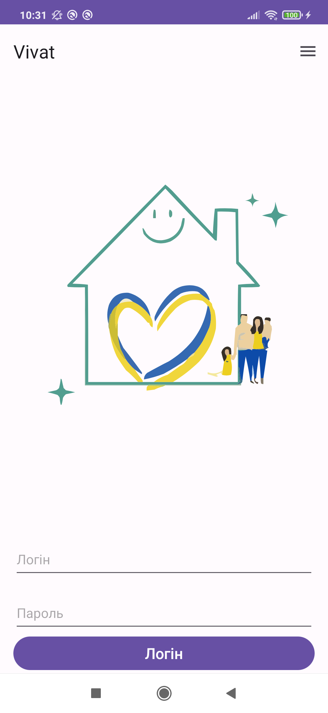

## Config
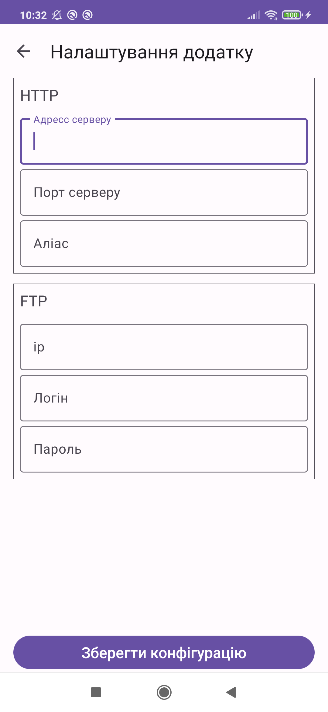

## Main
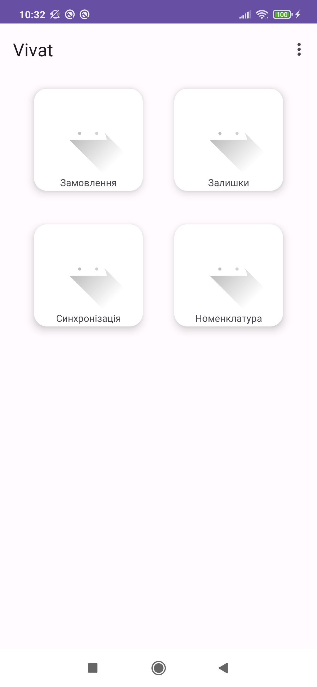

## Sync
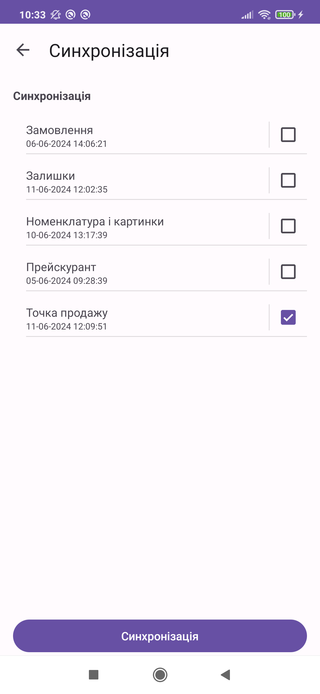

## Remainder
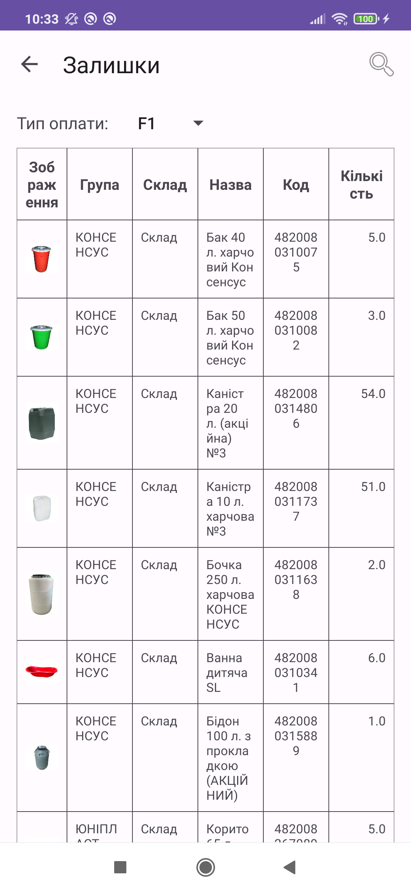

## Nomenclature
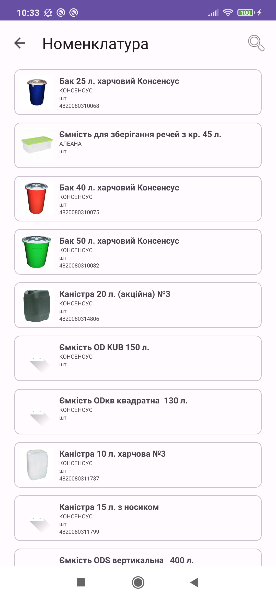

## Order
### list
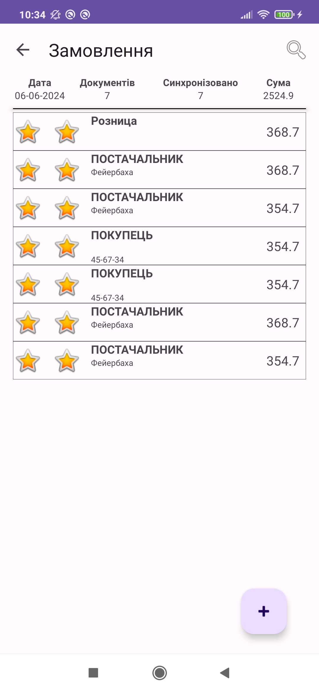

### new order
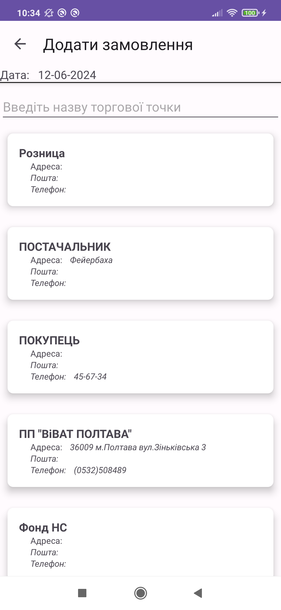

### edit order
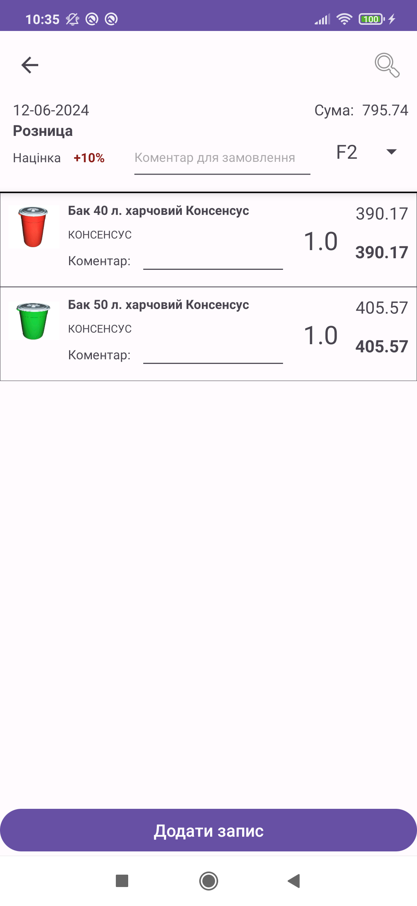

### landscape orientation
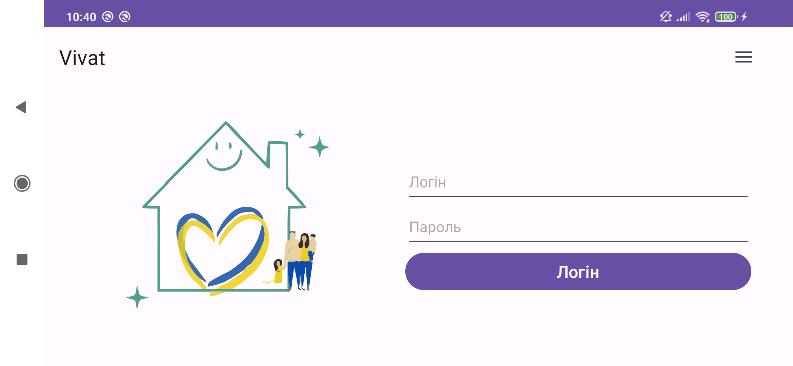

# Theme
## Light theme

## Dark theme
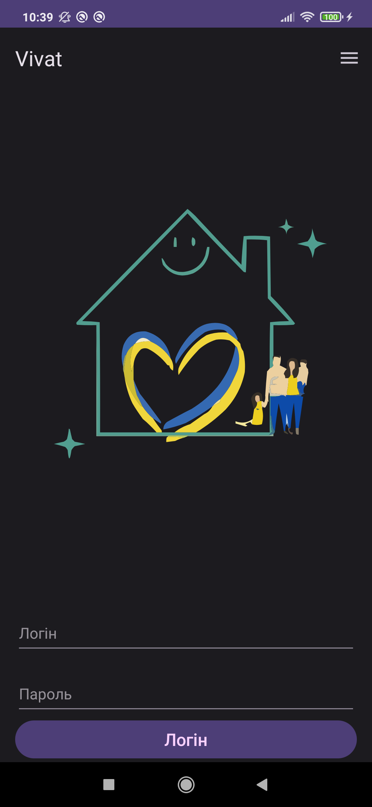

# Features
## Check latest version
* While the app is running, it subscribes to the availability of a new version, and if there is, the app sends a push notification to the user. You can also check the latest version in the menu of the top bar of programs in the main bar.

## Multi  language
* The app is multi language: English and Ukrainian. By default uses language setting from device.

## Suport dark and light them
* The app get theme value from device setting.

## Horizontal and vertical orientation
* When user change device orientation app dynamically recreated with new parameters.

## Offline Access and Orders saving
* Access data offline and save new orders locally on the device.

# Database Schema

